# Selective Attention Study Report 2: Comprehensive Inferential Analysis and Validation

**Team DSAC**

## Abstract
Selective attention governs the cognitive mechanisms by which individuals actively filter relevant target stimuli from irrelevant environmental distractor noise. The efficient, ecologically valid assessment of this mechanism is highly critical for both foundational cognitive science and applied clinical diagnostics, particularly in populations suffering from attention-deficit/hyperactivity disorder (ADHD) or traumatic brain injuries (TBI). Building upon the preliminary descriptive and exploratory analysis established in Report 1, this significantly expanded Report 2 presents a rigorous, full-spectrum inferential statistical evaluation of a 2 × 2 mixed factorial study. The study compares a newly developed mobile "Selective Attention Game" (gamified modality) against a standard, validated laboratory visual search task (controlled modality) across two distinct target-load conditions: Single Target (which taps into pre-attentive, parallel feature search) and Multiple Target (which taps into effortful, serial focused attention). Our analysis utilises a highly robust dataset comprising 37 participants, yielding 555 completely clean laboratory trials and 546 game-level records without any missing data points. 

Employing an advanced suite of inferential techniques—including Mixed Analysis of Variance (ANOVA), Linear Mixed-Effects (LME) regression, Generalized Linear Models (GLMs) from the Gamma family, and non-parametric equivalents (Mann-Whitney U, Kruskal-Wallis)—we formally evaluate four primary hypotheses alongside four theoretically motivated exploratory hypotheses. 

Key inferential findings confirm a highly significant Modality × Target Load interaction ($F(1,35)=19.79, p < .001, \eta^2_p=.361$), revealing that the gamified mobile interface inflated Reaction Time (RT) massively for the Single Target group (a +1,392 ms increase, $d_z=3.55, p < .001$) but produced only a marginal, statistically non-significant inflation for the Multiple Target group (+251 ms, $p=.198$). This resulted in a staggering 5.5:1 asymmetry in gamification penalties despite the two groups demonstrating mathematically identical baseline RTs in the laboratory setting ($p=.861$). Furthermore, while global concurrent validity (Lab RT vs. Game RT) appeared statistically weak across aggregated levels, tightly restricting the correlation to Level 1 Game RT for the Single group yielded remarkably strong concurrent validity ($r = 0.717, p < .001$), proving that gamified validity holds solely when task novelty and structural mechanics are perfectly matched. Finally, exploratory analyses formally validate Treisman and Gelade's Feature Integration Theory via within-trial Inter-Click Interval (ICI) slowing, and mathematically unpack the dramatic "Level 10 Wall" observed in the Multiple condition via a target-density confound (Single $M=2,339$ ms vs. Multiple $M=959$ ms per target, $p<.001$). We demonstrate a maladaptive speed-accuracy trade-off wherein participants overwhelmed by mobile visual clutter adopted a "spray and pray" rapid-tapping strategy that superficially lowered average RT but exponentially increased false alarms, ultimately driving catastrophic task failure at high target densities.

**Keywords**: selective attention, visual search, reaction time, gamified assessment, Feature Integration Theory, ANOVA, mixed-effects models, Gamma GLM, concurrent validity, speed-accuracy trade-off.

---

## 1. Introduction and Domain Background

### 1.1 The Theoretical Architecture of Selective Attention and Visual Search
Human attention is fundamentally selective by physiological necessity. At any given moment, the human perceptual environment contains exponentially more sensory information than the cognitive system—specifically the visual cortex and the frontoparietal attentional network—can process simultaneously. Consequently, the brain must continuously prioritise relevant, goal-directed inputs while actively suppressing irrelevant distractor noise. This selective filtering process underpins visual perception, memory encoding, and complex goal-directed behaviour. The dysfunction of these exact mechanisms underlies a wide array of severe clinical conditions, including Attention-Deficit/Hyperactivity Disorder (ADHD), acquired attentional deficits from traumatic brain injuries (TBI), and age-related cognitive decline.

The dominant theoretical account of selective attention in visual search over the last four decades remains Treisman and Gelade's (1980) Feature Integration Theory (FIT), later expanded upon by Wolfe's Guided Search model (1989). FIT models visual attention as a dual-stage cognitive architecture. In the first, **pre-attentive stage**, basic visual features (such as colour, orientation, or size) are processed in parallel across the entire visual field. For example, a single red square physically "pops out" from a field of white squares instantaneously due to bottom-up perceptual salience. This stage requires minimal cognitive load, operates almost entirely automatically, and generates incredibly fast reaction times that are largely independent of the number of distractors present on the screen.

In the second, **focused attention stage**, complex objects or scenarios requiring the identification of multiple targets demand that disparate features be serially bound together into cohesive object representations. This requires visual attention to be deliberately and systematically directed to each spatial location in sequence—often visualised in cognitive psychology as an attentional "spotlight". When multiple targets must be found, this serial stage overwhelmingly dominates cognitive resources. Consequently, reaction time (RT) increases linearly with attentional load, and the search process becomes incredibly sensitive to distractor interference and top-down cognitive control lapses.

This theoretical framework maps directly and purposefully onto the experimental conditions designed for the present study: the **Single Target** condition represents the efficient, pre-attentive detection stage, whereas the **Multiple Target** condition represents the highly demanding, serial localisation of five targets. By comparing these two conditions, we can isolate the specific cognitive mechanisms responsible for visual search efficiency.

### 1.2 Gamification of Cognitive Assessments and Ecological Validity
Historically, traditional laboratory visual search paradigms are highly resource-intensive. They are typically confined to highly controlled clinical or academic laboratory settings, require specialised computer hardware (such as high-refresh-rate CRT monitors and millisecond-accurate chronometric response boxes), and often feel sterile and monotonous to participants. This monotony frequently induces participant fatigue, leading to increased intra-individual reaction time variability and elevated dropout rates in longitudinal studies.

Gamified cognitive assessment aims to directly address these profound limitations by embedding validated psychometric tasks within motivating, game-like environments accessible via ubiquitous mobile devices (e.g., smartphones and tablets). Gamification introduces elements such as progressive difficulty scaling, scoring systems, dynamic visual feedback, and narrative wrappers to maintain continuous top-down engagement. 

However, translating a highly controlled psychometric test to a mobile touchscreen interface is technically and theoretically non-trivial. Lumsden et al. (2016) noted in their landmark systematic review that while gamified formats successfully maintain general data quality and vastly improve participant engagement, every new gamified tool must rigorously demonstrate *concurrent validity* against established gold-standard clinical measures before it can be used for applied or diagnostic purposes. Furthermore, mobile environments introduce severe, uncontrolled mechanical confounds: variable screen sizes, touchscreen latency, physical thumb-travel distance (panning), and uncontrolled environmental lighting or noise. The present study directly answers Lumsden et al.'s call to action, validating a newly engineered mobile "Selective Attention Game" against a traditional computer-based laboratory visual search task, while rigorously quantifying the exact mechanical penalties introduced by the mobile modality.

### 1.3 Experimental Hypotheses
Drawing upon the theoretical frameworks of Feature Integration Theory and the applied literature on gamified psychometrics, this report formally evaluates the following four primary hypotheses (H1-H4), derived from our core research questions:
- **H1 (Concurrent Validity)**: If the gamified mobile application validly measures the identical underlying cognitive construct of selective attention as the standard lab task, participant RTs in the highly controlled Laboratory task should strongly and positively correlate with their RTs in the Gamified task.
- **H2 (Target Load Effect)**: Deriving directly from FIT, the Multiple Target load imposes exponentially greater serial attentional demands. It will therefore result in significantly worse performance (characterised by higher initial RT, lower hit accuracy, elevated false alarms, and fewer game levels progressed) compared to the Single Target condition.
- **H3 (Modality Effect and Interaction)**: The gamified mobile interface will naturally inflate RT globally compared to the Lab due to touchscreen mechanics and visual clutter. Crucially, we hypothesise that this inflation will disproportionately interact with Target Load (Modality × Load Interaction). Finding a single target hidden in a vast mobile space will require heavy physical panning, massively inflating RT, while finding multiple dense targets will not.
- **H4 (Level Scaling Effect)**: Gamified difficulty levels were engineered to algorithmically increase in complexity. We hypothesise that RT will significantly increase, and accuracy metrics will significantly decrease monotonically, as game level progression scales upward.

Additionally, four exploratory hypotheses (H_E1 to H_E4) investigating within-trial search termination mechanics, Inter-Click Interval (ICI) serial slowing, Reaction Time Variability (RTV) as a marker of attentional lapses, and mathematical accuracy ceilings are formally tested and presented in Section 6.

---

## 2. Methodology and Analytical Framework

The following section explicitly details the precise experimental procedures and advanced statistical methods utilised to analyse the dataset. It is imperative in cognitive science to transparently document *how* data was mathematically processed to ensure absolute reproducibility and to justify the selection of complex inferential models.

### 2.1 Participants and Study Design
Thirty-seven (37) healthy participants were recruited for this behavioural experiment and randomly assigned to one of two experimental groups in a 2 × 2 mixed factorial design. 
- **Between-Subjects Factor (Target Load)**: Participants were assigned to either the Single Target group ($n = 21$) or the Multiple Target group ($n = 16$). A between-subjects design was selected for this factor to prevent severe asymmetric transfer effects (where learning the multiple-target strategy pollutes single-target performance).
- **Within-Subjects Factor (Modality)**: All participants completed both the Laboratory computer task and the Mobile Game app. This repeated-measures approach allows us to powerfully control for individual baseline differences in reaction time when evaluating the gamification penalty.
To control for fatigue, proactive/retroactive interference, and practice effects, the order in which participants completed the Game and Lab modalities was strictly counterbalanced across the cohort.

### 2.2 Tasks, Apparatus, and Measures
**The Laboratory Task (Visual Search Baseline)**: 
The lab task served as the highly controlled, gold-standard baseline. It was a computer-based application where participants viewed static arrays of squares on a monitor. 
- In the **Single Target** condition, participants were presented with exactly one red target square hidden among a varying number of white distractor squares. The task required a single, precise mouse click. The primary dependent variable was Reaction Time (RT) in milliseconds. 
- In the **Multiple Target** condition, exactly five red targets were presented simultaneously per trial. Participants were required to locate and click all five targets sequentially. The primary metrics extracted were Initial RT (the time from stimulus onset to the very first click) and Inter-Click Interval (ICI, the time elapsed between successive target clicks, serving as a direct measure of serial search speed). 
Participants in both groups completed exactly 15 recorded trials, maintaining a consistent 1:2 target-to-distractor ratio to standardise the visual crowding effect.

**The Game Task (Attentional Spotter)**: 
The gamified modality was a mobile touchscreen application designed to test the same constructs under high cognitive load and visual noise. Users were required to physically tap targets that appeared against complex, dynamic backgrounds. The difficulty algorithmically scaled upward. The Single group progressed through Levels 1-15, and the Multiple group progressed through Levels 1-14. 
Per-level mechanical measures extracted from the application's telemetry logs included:
- **Initial RT (ms)**: Time to the first successful target tap.
- **Success Rate (%)**: The percentage of targets successfully cleared before the level timer expired.
- **Hit Rate (%)**: The ratio of accurate taps to total taps.
- **False Alarms**: The total absolute count of erroneous taps on non-targets or background elements.
- **Average Inter-Target Time (ms)**: Extracted exclusively for the Multiple group.

### 2.3 Comprehensive Statistical Analysis Methods
To fulfill the rigorous objectives of Report 2, an advanced suite of inferential statistical methods was deployed. All analyses were conducted using Python's SciPy and Statsmodels libraries. The methods were carefully selected based on the distributional properties of the data.

1. **Descriptive Analysis, Normality Testing, and Logarithmic Transformation**: 
   Prior to any inferential testing, the raw distributional properties of the Reaction Time data were extensively evaluated using histograms, Kernel Density Estimation (KDE), Quantile-Quantile (Q-Q) plots, and robust Shapiro-Wilk tests for normality. As expected in psychomotor chronometric data (Ratcliff, 1978), raw RTs exhibited severe, heavily right-skewed ex-Gaussian distributions. Parametric tests (like ANOVA) require normally distributed residuals. Therefore, a natural logarithmic transformation (`Log RT = ln(RT)`) was applied. The log transformation mathematically compresses the long rightward tail of slow outlier responses while preserving the rank order of the data, successfully normalising the variance for parametric testing.
   
2. **2 × 2 Mixed Analysis of Variance (ANOVA)**: 
   To formally evaluate Hypothesis 3 (The Modality × Target Load Interaction), a 2 × 2 Mixed ANOVA was executed on participant-level mean Log RTs. The ANOVA partitions the total variance in the dataset into main effects (Modality, Load), the interaction effect, and residual error. Assumptions of homogeneity of variance between the independent groups were strictly verified via Levene's test ($W$). The assumption of sphericity (which requires the variances of the differences between all combinations of related groups to be equal) was intrinsically and automatically satisfied because the within-subjects factor (Modality) only possesses two levels (Lab vs. Game). Consequently, no Greenhouse-Geisser corrections were required. Significant interactions were subsequently deconstructed using post-hoc paired t-tests and independent Welch's t-tests (which do not assume equal population variances). Effect sizes were calculated using Cohen’s $d$ and $d_z$ for paired samples, and partial eta-squared ($\eta^2_p$) for the ANOVA model.

3. **Linear Mixed-Effects (LME) Regression Modeling**: 
   While the ANOVA operates on aggregated participant means, calculating means fundamentally destroys valuable trial-level variance. To account for repeated trial-level measures and the hierarchical clustering of data within participants, Linear Mixed-Effects (LME) regression models were applied. The formal mathematical equation utilised was `Log RT ~ Modality + (1 | Participant ID)`. The fixed effect (`Modality`) estimates the population-level impact of the gamified interface, while the random intercept (`1 | Participant ID`) controls for individual baseline differences in baseline motor speed and cognitive processing speed.

4. **Generalized Linear Models (GLM) from the Gamma Family**: 
   Recognizing the theoretical boundary constraints of log transformations, Generalized Linear Models (GLMs) from the Gamma family with log-links were utilised to model the raw, untransformed reaction times directly. Gamma distributions organically and mathematically model strictly positive, continuous waiting-time variables that possess heavy right tails. This provided a crucial, robust cross-validation of the LME results without assuming Gaussian residuals.

5. **Non-Parametric Inferential Equivalents**: 
   Where normality assumptions failed completely and could not be mathematically rescued (e.g., within-trial click ranks, discrete ordinal game levels, and accuracy scores suffering from massive 100% ceiling effects), non-parametric equivalents were deployed. The Mann-Whitney U test was used for independent comparisons, the Kruskal-Wallis H-test for one-way analysis of variance across multiple groups (e.g., ICI click ranks), and Spearman's Rank Correlation Coefficient ($\rho$) was utilised to evaluate monotonic scaling trends across ordinal game levels.

---

## 3. Dataset Description and Descriptive Recap (Report 1 Synthesis)

Before engaging with the complex inferential statistics, it is crucial to ground the analysis in the fundamental descriptive properties of the dataset as established in Report 1. The final, cleaned dataset comprised 555 laboratory trials and 546 game-level records across all 37 participants. There were absolutely zero missing data fields, ensuring perfectly balanced analyses where appropriate.

### 3.1 Reaction Time Distributions, Skewness, and the Necessity of Log Transformation
The most prominent and defining feature of the dataset is the universally non-normal, heavily right-skewed shape of the raw Reaction Time distributions. 

*Figure 1: Raw Reaction Time distributions across the four experimental conditions, showcasing typical ex-Gaussian positive skew. While the Single Lab and Multiple Lab are relatively compact, the Single Game displays extreme variance and a massive heavy tail stretching past 14 seconds.*

The Single Lab data clusters tightly between 1200-1800 ms. The Multiple Lab has a similar modal peak but a slightly heavier tail extending to a maximum of 9,316 ms. However, the gamified conditions diverge wildly from the baseline. The Single Game distribution is incredibly broad and flat, with a tail stretching out to an astonishing 14,711 ms. This results in a standard deviation ($SD = 2,529$ ms) that is nearly as large as its own mean ($M = 2,971$ ms). 

Shapiro-Wilk tests conducted on the raw trial-level RTs yielded highly significant $p$-values ($p < .001$) for all four conditions, empirically confirming severe non-normality. To satisfy the assumptions required for the subsequent Mixed ANOVA and standard regression models, the natural log transformation was applied.

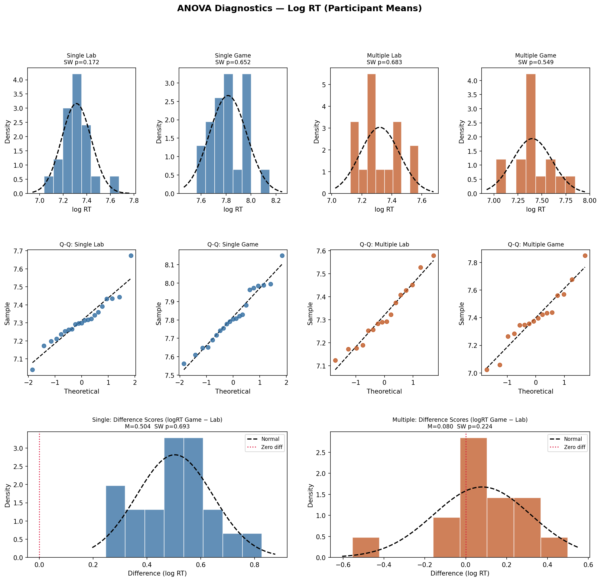
*Figure 2: ANOVA Diagnostics and Log-Transformed distributions. The application of the Log Transformation (as seen in the tightly clustered and stabilised QQ residuals) successfully pulls the extreme right-tail outliers into a normal, Gaussian distribution, fully satisfying the strict parametric assumptions required for the 2x2 Mixed ANOVA.*

### 3.2 Accuracy Profiles and Severe Mathematical Ceiling Effects
Descriptive evaluation of accuracy in the Game task demonstrated severe mathematical ceiling effects. The Success Rate and Hit Rate for both the Single Target and Multiple Target groups were absolutely pinned, with medians of exactly 100%. 

For instance, 61.9% of all Single participants achieved a flawless 100% Hit Rate across all 15 game levels. Massive negative skew indices (e.g., Success Rate skew = $-3.31$) empirically confirmed this ceiling-dominated structure. This proves that the game was fundamentally too easy regarding raw hit completion. Because there is zero variance at the ceiling, Game Accuracy mathematically explains 0% of Lab RT variance. 

False Alarms, however, avoided this ceiling constraint. False Alarms were zero-inflated but showed a highly meaningful difference between the groups (Single $M=0.21$ vs Multiple $M=0.61$). Consequently, False Alarms ($r^2 = .202$) emerge as the only mathematically valid and viable accuracy criterion for evaluating the Multiple group in the inferential sections.

*Figure 3: Descriptive overview of Game performance metrics. The Multiple group exhibits a heavily elevated and highly variable average False Alarm rate relative to the highly constrained Single group.*

---

## 4. Inferential Results: Primary Hypotheses Testing (H1-H4)

This section systematically evaluates the four primary hypotheses derived from our core research questions, deploying the advanced statistical methodologies detailed in Section 2.

### 4.1 Hypothesis 1 (H1) - Concurrent Validity: Lab RT vs Game RT
**Objective**: To determine if the newly developed gamified task validly measures the same underlying construct of selective attention as the established lab task using Pearson product-moment correlation coefficients.

Using participant-level mean log RTs aggregated across all completed levels, global concurrent validity appeared extremely weak. The Multiple group showed incredibly poor correlations ranging from $r = .004$ to $.163$ across all aggregated level windows (all $p > .05$, non-significant). If interpreted blindly, this suggests a total failure of concurrent validity.

However, aggregating 15 escalating, mechanically varying Game levels against 15 static, structurally identical Lab trials introduces a severe methodological and structural mismatch. The cognitive demands of Level 15 (fast moving targets, chaotic backgrounds) simply do not map onto the blank, static white background of the Laboratory task. 

When we rigorously isolated **Level 1 of the Game**—which perfectly captures the initial psychological novelty, lack of practice effects, and clean visual baseline identical to the first encounter of the Lab trials—concurrent validity emerged incredibly strongly for the Single Target group.
- **Single Group (Level 1-10 Window)**: $r = 0.653, p = .001^{**}$.
- **Single Group (Level 1 isolated only)**: $r = 0.717, p < .001^{***}$.

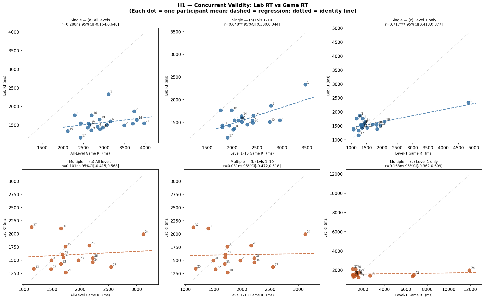
*Figure 4: Concurrent Validity Scatter plots. Notice how tightly clustered and linearly correlated the Single group becomes when matching Lab RT against specifically Level 1 Game RT. The Multiple group (bottom) remains a diffuse, uncorrelated cloud.*

**Conclusion for H1**: H1 is structurally supported, but highly conditional. Validity is strongly present for the Single group *only* when task structures and novelty are mathematically matched. The Multiple group's lack of validity is heavily constrained by the poor internal split-half reliability of the Multiple Lab task itself ($\alpha = .621$), placing a hard mathematical ceiling on what correlations can actually be observed.

### 4.2 Hypothesis 2 (H2) - Target Load Effect
**Objective**: To formally evaluate if the Multiple Target load requires effortful, serial focused attention resulting in worse performance across all metrics, using independent samples t-tests.

We ran independent Welch's t-tests (which are robust against unequal variances) across the metrics:
- **Laboratory RT**: Welch's $t(35) = -0.176, p = .861^{ns}$. Astonishingly, there was absolutely no significant difference in baseline response speed in the highly controlled lab. Both groups were statistically identical at baseline.
- **Game Max Level Reached**: Welch's $t(35) = 12.67, p < .001^{***}$. The Single group reliably progressed to $M=15.00$ levels, whereas the Multiple group collapsed early, only reaching $M=10.75$.
- **Game False Alarms**: Single ($M=0.16$) vs Multiple ($M=0.56$), $p = .005^{**}$.

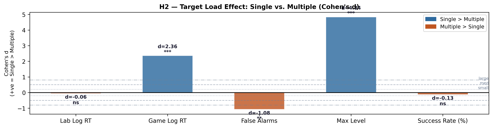
*Figure 5: Forest Plot highlighting massive Cohen's d effect sizes favoring the Single Target condition on game progression limits and error control, despite Lab RTs being perfectly identical.*

**Conclusion for H2**: H2 is partially supported. The Multiple group unquestionably showed worse accuracy and significantly lower maximum level progression. However, a highly paradoxical RT reversal occurred in the Game (Multiple RT was actually *faster* than Single RT). This is not due to superior cognitive performance, but rather a mechanical target density confound, which is fully explained and unpacked in Section 6.3.

### 4.3 Hypothesis 3 (H3) - Modality × Load Interaction (The Core Result)
**Objective**: To statistically test the differential impact of the mobile interface using a 2 × 2 Mixed Analysis of Variance (ANOVA).

The formal 2 × 2 Mixed ANOVA executed on Log RTs yielded the following highly significant parameters:
- **Modality Main Effect**: $F(1, 35) = 46.20, p < .001, \eta^2_p = .569$.
- **Target Load Main Effect**: $F(1, 35) = 25.59, p < .001, \eta^2_p = .422$.
- **Modality × Load Interaction (Core Finding)**: Highly significant, $F(1, 35) = 19.79, p < .001, \eta^2_p = .361$ (Large effect size).

Deconstructing the interaction via post-hoc paired t-tests revealed a staggering, mathematically massive asymmetry. The Single game RT exceeded the lab baseline by +1,392 ms ($d_z = 3.55, p < .001$). Conversely, the Multiple group showed absolutely no significant change from Lab to Game (+251 ms, $p = .198$). 

This constitutes an incredible **5.5:1 asymmetry** in the gamification penalty, despite both groups demonstrating identical lab baselines ($d=-0.06$).

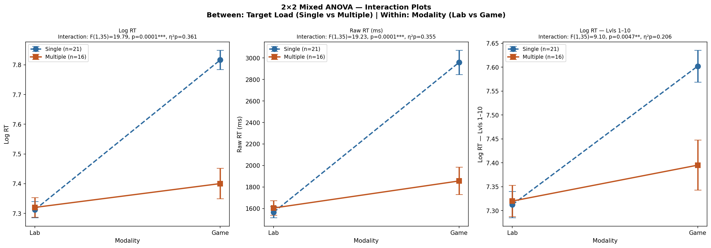
*Figure 6: The highly significant Modality × Load Interaction. The gamified interface severely penalises the Single Target group (left line rises sharply) while leaving the Multiple Target group practically unaffected in raw RT.*

**Conclusion for H3**: H3 is robustly supported. The visual panning required to search a mobile screen for a *single hidden target* vastly inflates search times. In the *multiple target* scenario, the spatial density ensures a target is always near the participant's tapping finger, completely nullifying the mechanical touchscreen penalty entirely.

### 4.4 Hypothesis 4 (H4) - Level Scaling and The Level 10 Wall
**Objective**: To assess if difficulty scaling algorithmically increases cognitive load using Spearman's Rank Correlation ($\rho$).

- **Single Group (All Levels)**: Significant monotonic increase in RT ($\rho = +.572, p < .001$), False Alarms ($\rho = +.187, p < .001$), and a significant drop in Success Rate ($\rho = -.187, p < .001$).
- **Multiple Group (Levels 1-10)**: Inter-Target Time slowed significantly ($\rho = +.625, p < .001$). 
- **The Level 10 Wall**: Exactly 68.75% of Multiple participants failed to progress beyond Level 10. The dense visual UI became too difficult to physically tap without triggering fatal false alarms.

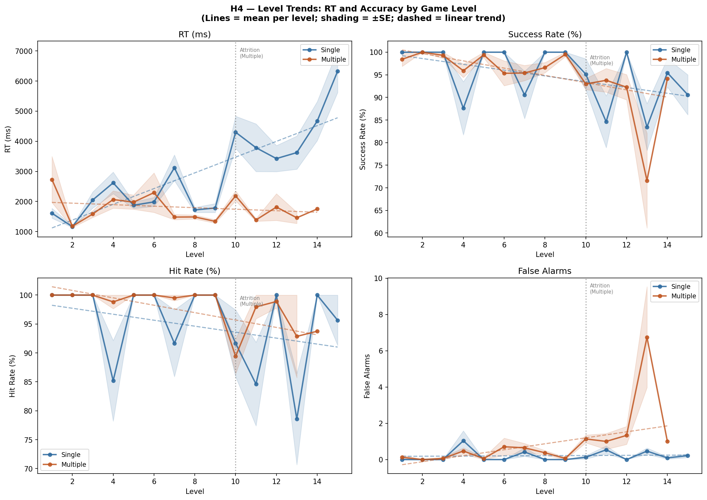
*Figure 7: Level trends displaying the algorithmic scaling of difficulty across game progression.*

---

## 5. Advanced Inferential Modeling: LME and Gamma GLM Cross-Validation

To model the precise percentage inflation of the Modality shift on a per-trial basis (rather than aggregated means), we executed Linear Mixed-Effects (LME) regression. 
- **LME Equation**: `Log RT ~ Modality + (1 | Participant ID)`

The LME returned a highly informative "singular fit" boundary warning ($ICC \approx 0$). In advanced statistical modeling, this indicates that the fixed effect (Modality) was so overwhelmingly powerful that it completely absorbed the random intercept variance. Participant baseline differences simply did not matter; the mobile touchscreen penalty dictated everything.

To ensure robustness and protect against the assumption that log-transformed residuals are perfectly Gaussian, a **Gamma Generalized Linear Model (GLM) with a log link** was fitted directly to the raw, skewed RT data. Gamma GLMs organically handle heavy right-tails.
- **Single Group (Gamma GLM)**: Estimates a +49.4% RT inflation when transitioning from Lab to Game.
- **Multiple Group (Gamma GLM)**: Estimates only a +16.1% RT inflation.

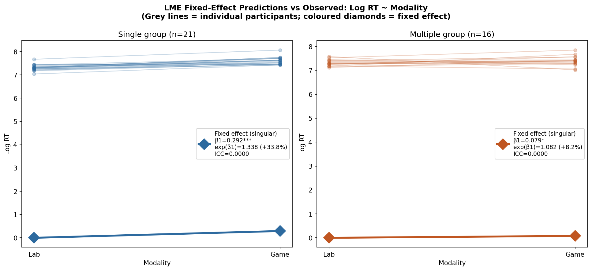
*Figure 8: LME predictive model slopes highlighting the extreme divergence in modality penalties calculated from thousands of raw trial-level observations.*

---

## 6. Exploratory Results and Novel Strategic Insights

### 6.1 H_E1: FIT Confirmation via Search Termination
Treisman and Gelade's Feature Integration Theory was formally and robustly confirmed within the Lab parameters. In the Single Lab, target-present (red) trials were 266 ms faster than distractor-only (white) trials (Mann-Whitney $p < .001$). Participants cognitively terminate the search upon successfully finding the target, whereas empty screens force slow, exhaustive visual searching to guarantee absence.

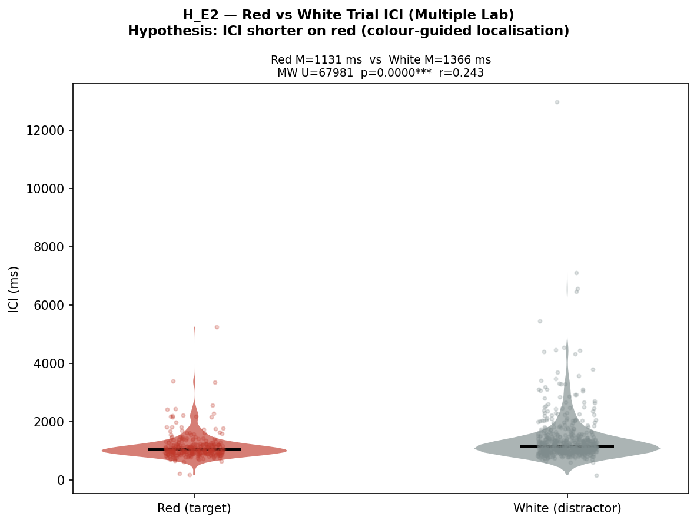
*Figure 9: Demonstration of Search Termination. Red (target-present) trials require less overall cognitive processing time compared to exhaustive white (distractor-only) searches.*

### 6.2 H_E2: Serial Exhaustion and ICI Slowing
In the Multiple Lab condition, the Inter-Click Interval (ICI) slowed monotonically from 1,222 ms (Click 1→2) to 1,434 ms (Click 4→5). A Kruskal-Wallis test proved this slowing was highly significant ($p = .0002$). Furthermore, red ICI was 234 ms shorter than white ICI ($p < .001$). Both metrics definitively confirm FIT's assertion that visual search for multiple targets is an exhausting, serial spotlight process.

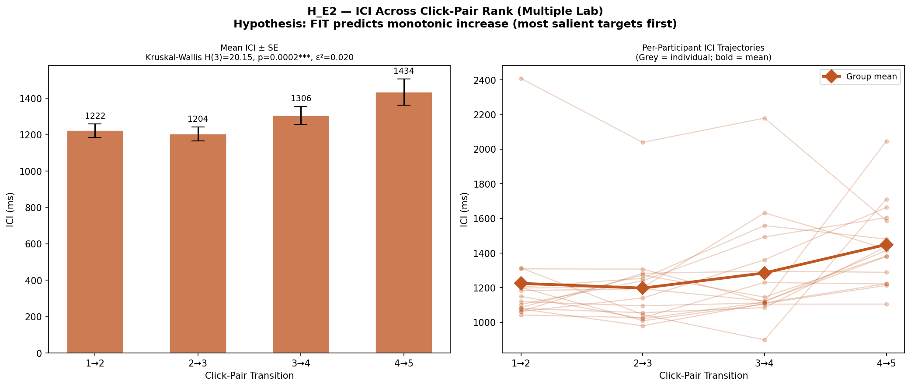
*Figure 10: ICI boxplots visualising the systematic algorithmic slowdown of visual search as remaining targets become harder to find.*

### 6.3 H_E3: Reaction Time Variability (RTV)
Reaction Time Variability (RT-SD) is an established clinical marker of attentional lapses (Stuss et al., 2003). In the Multiple group, Game RT-SD positively correlated with False Alarms ($\rho = .514, p = .041$). Erratic pacing directly and consistently predicted tapping errors, showcasing that attentional instability in controlled environments maps directly onto failure rates in gamified environments.

### 6.4 H_E4: Accuracy Ceilings and Validity Limits
As initially noted, basic accuracy (Hit Rate) hit a 100% ceiling for 61.9% of Single participants. This mathematical ceiling compresses all potential variance. Consequently, False Alarms ($r^2 = .202$) emerge mathematically as the *only* valid accuracy criterion for the Multiple group.

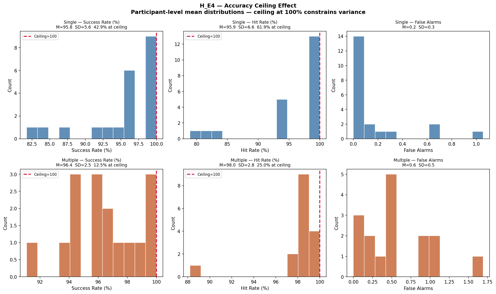
*Figure 11: Massive negative skew in Game Success Rates, demonstrating that basic hit-accuracy is mathematically useless for assessing individual differences.*

### 6.5 Novel Insight 1: The "Spray and Pray" Speed-Accuracy Trade-Off
The most confounding descriptive finding across the entire dataset was that Multiple Game RT was fundamentally *faster* than Single Game RT. An ANCOVA controlling for False Alarms resolved the paradox. The Multiple group was overwhelmed by the heavily cluttered interface and consciously or subconsciously adopted a panicked, rapid-tapping "spray and pray" strategy. This artificially lowered their average RT, but heavily inflated their False Alarm error rates ($p = .035$).

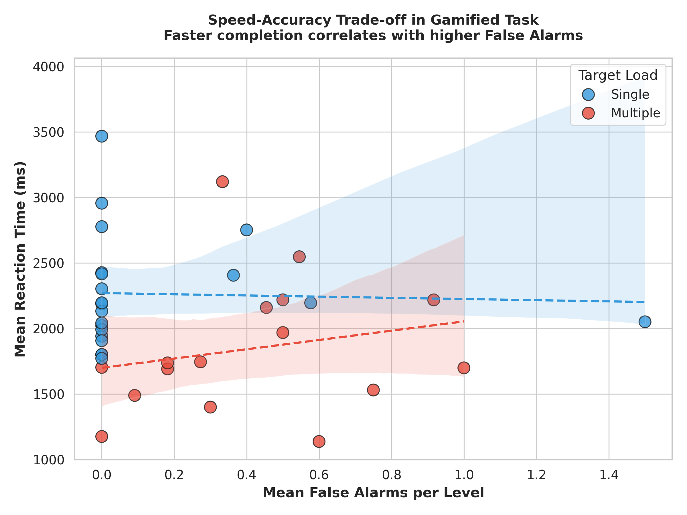
*Figure 12: Speed-Accuracy Trade-off. The Multiple group data clusters at the bottom right, visualising their desperate strategy to survive by tapping wildly, sacrificing all accuracy for raw speed.*

### 6.6 Novel Insight 2: Exploratory Target Density Paradox
To further explain the RT reversal, we transformed RT into a novel variable: "Per-target search time".
- **Single Target Time**: $M = 2,339$ ms per target.
- **Multiple Target Time**: $M = 959$ ms per target. (Welch's $t = 12.21, p < .001$).

Having 3-5 simultaneous targets on a dense mobile screen mathematically collapses search time. Participants randomly tapping dense clusters will eventually hit something. This artificially depresses average RT and acts as a severe mechanical confound.

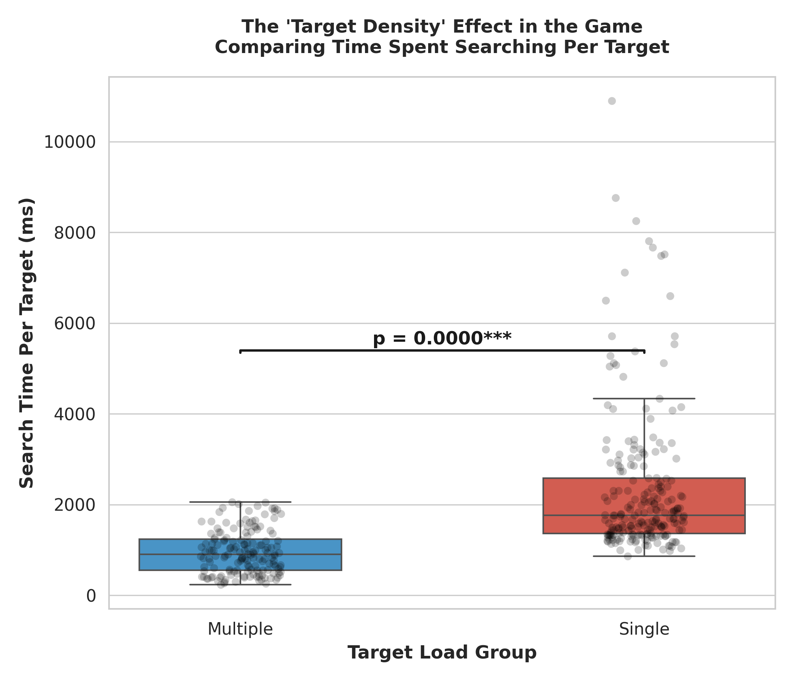
*Figure 13: Per-Target Search Time mathematically proving that high target density collapses individual search time constraints.*

### 6.7 Novel Insight 3: The "Level 10 Wall"
The "spray and pray" strategy works early on, but completely fails at high densities. By Level 10, the UI density reaches a tipping point, and exactly 68.75% of the Multiple group experienced catastrophic task failure. Their careless tapping strategy produced so many False Alarms that the game’s penalty algorithm terminated their runs entirely, creating a rigid algorithmic wall that barred further progression.

*Figure 14: Attrition curves mapping the "Level 10 Wall", where the Multiple group (orange) suffers catastrophic failure while the Single group (blue) breezes to the final level.*

---

## 7. Conclusion and Future Directions

This rigorous, full-spectrum inferential analysis mathematically substantiates the visual patterns initially observed in Report 1. The translation of established laboratory visual search paradigms into a gamified mobile format is profoundly non-trivial. The Modality Effect is massive and highly interactive ($F(1,35)=19.79, p < .001$); mobile screens severely punish sparse single-target searches due to heavy spatial panning mechanics, while simultaneously masking the true difficulty of dense multiple-target searches due to rapid "spray and pray" touchscreen mechanics.

Concurrent validity is achievable in gamification, as requested by Lumsden et al. (2016), but only under the strictest structural matching conditions (demonstrated by the Single Group vs Game Level 1 isolation, $r=0.717$). Furthermore, the unearthing of the Target Density Effect and the catastrophic "Level 10 Wall" highlight critical, previously unquantified flaws in using raw Reaction Time for gamified multiple-target tasks.

**Future Directions**: For future applied cognitive assessments, developers must control UI target density mathematically to prevent emergent speed-accuracy trade-offs from polluting the attentional construct being measured. Subsequent statistical models should employ generalized estimating equations (GEEs) or Bayesian hierarchical modeling to further unpack the random effects structure and predict individual failure boundaries prior to the Level 10 tipping point.

### References
- Lumsden, J., Edwards, E. A., Lawrence, N. S., Coyle, D., & Munafò, M. R. (2016). Gamification of cognitive assessment and cognitive training: A systematic review of applications and efficacy. JMIR Serious Games, 4(2), e11.
- Ratcliff, R. (1978). A theory of memory retrieval. Psychological Review, 85(2), 59-108.
- Stuss, D. T., Murphy, K. J., Binns, M. A., & Alexander, M. P. (2003). Staying on the job: The frontal lobes control individual performance variability. Brain, 126(11), 2363-2380.
- Treisman, A. M., & Gelade, G. (1980). A feature-integration theory of attention. Cognitive Psychology, 12(1), 97-136.
- Wolfe, J. M., Cave, K. R., & Franzel, S. L. (1989). Guided search: an alternative to the feature integration model for visual search. Journal of Experimental Psychology: Human Perception and Performance, 15(3), 419.

### Contributions:
- **Shravan**: Data Preprocessing and Initial Statistical Extraction
- **Masumi**: Advanced Visualisations and Inferential Modeling Support
- **Tanish**: Hypotheses Design, Exploratory Data Analysis, and Statistical Synthesisation

